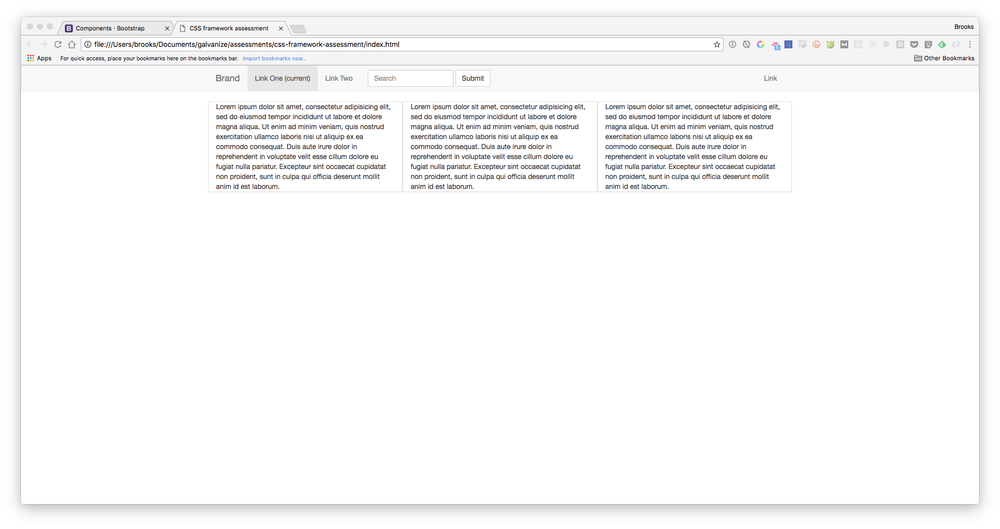
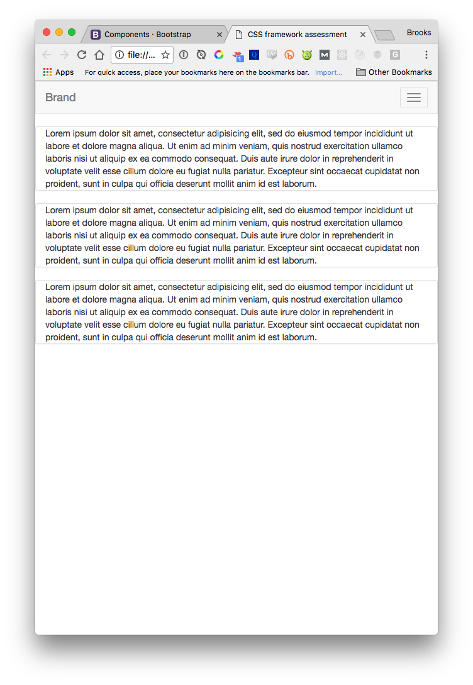

# Build a Responsive Web Page with a CSS Framework Assessment

For this assessment you will be creating a basic html file and styling it with only a CSS Framework like Bootstrap or Materialize.

In order to score a 3, the following must be met

[] Include Bootstrap, Materialize or a similar framework
[] Include a nav
[] Include a multi-column layout
[] The Nav must collapse when the window shrinks

Note that you cannot define your own CSS rules / bring in a custom css file.

## As an example take a look at the example screenshots

